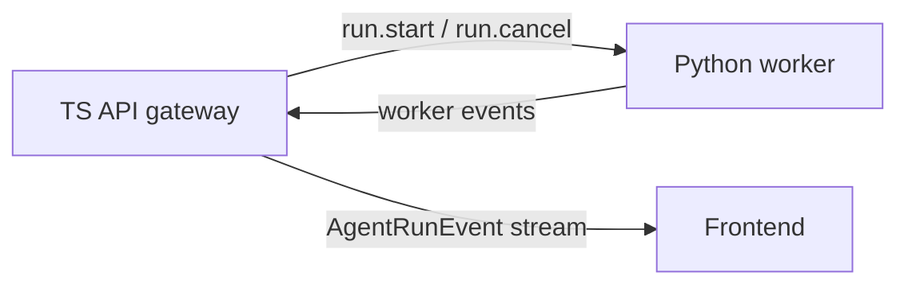

# Agent Run Worker Protocol

The Agent Run worker protocol is the language-neutral seam between this TypeScript repository and
an external LangGraph runtime worker. This repository owns the shared contract and browser-facing
Agent Run stream. A Python runtime repository owns LangGraph execution and experiment tooling.
The selected Python runtime repository is `tihaya-anon/agent-runtime-python`.

The initial transport is NDJSON over worker stdio. Each line is one complete JSON object, encoded
without embedded record delimiters. The protocol version is `1`.



## Commands

The gateway sends commands to the worker.

### `run.start`

Starts one Agent Run.

Required fields:

- `version`: `1`
- `type`: `"run.start"`
- `agentRunId`: non-empty Agent Run identifier assigned by the TS gateway
- `input`: existing `AgentRunRequest`
- `runtimeProfile`: existing `RuntimeProfile`
- `behaviorVersion`: Agent Behavior Version values accepted by the supplied Runtime Profile

The worker must validate the command before graph execution. If validation fails after the worker
can emit events, it emits `run.failed` with `errorClassification: "validation"`.

### `run.cancel`

Requests cancellation for one Agent Run.

Required fields:

- `version`: `1`
- `type`: `"run.cancel"`
- `agentRunId`: non-empty Agent Run identifier

The worker should treat repeated cancellation requests as idempotent.

## Worker Events

The worker emits protocol events back to the TS gateway. The gateway translates these into the
browser-facing Agent Run stream and may suppress worker-only progress.

Reused Agent Run events:

- `run.started`
- `message.delta`
- `run.completed`
- `run.failed`
- `run.cancelled`

Worker progress event:

- `type`: `"progress.update"`
- `scope`: `"run"` or `"task"`
- `label`: stable, non-empty product-safe progress label
- `status`: optional `"started"`, `"running"`, `"completed"`, `"failed"`, or `"cancelled"`
- `message`: optional product-safe progress text

Progress events must not expose raw LangGraph chunk shapes, prompts, provider payloads, stack
traces, or other diagnostic-private data. Detailed diagnostics belong in OpenTelemetry and
OpenInference telemetry, not in the browser-facing product protocol.

## Ownership

- This repository owns `packages/shared/src/schemas/agent-run-worker.ts`, the TS API gateway, and
  frontend stream stability.
- `tihaya-anon/agent-runtime-python` owns graph execution, Python LangGraph stream interpretation,
  and experiment performance.
- Shared protocol changes should start in this repository, then be consumed by the Python runtime
  repository through an explicit schema publication or vendoring path.

## Schema Sharing

The canonical schemas are the Zod definitions in
`packages/shared/src/schemas/agent-run-worker.ts`. Python consumers should use the checked-in JSON
Schema artifacts:

- `packages/shared/json-schema/agent-run-worker-command.schema.json`
- `packages/shared/json-schema/agent-run-worker-event.schema.json`

Regenerate those artifacts after protocol changes:

```bash
pnpm --filter @teach-everything/shared schema:agent-run-worker
```

The shared package tests compare the artifacts against the generator output so stale files are
caught before commit.

## Migration Order

1. Define and test this shared protocol in this repository.
2. Create the separate Python runtime repository and document schema consumption.
3. Implement the Python worker against this protocol.
4. Add the TS API adapter that starts, cancels, and translates worker runs.
5. Verify the frontend stream remains stable before switching defaults.
