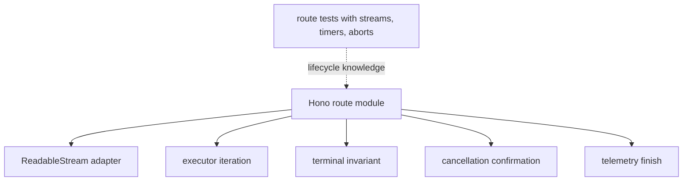
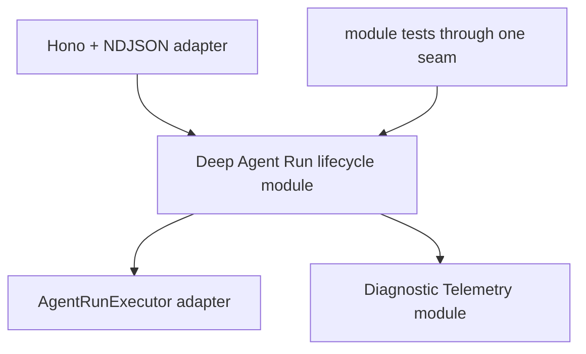
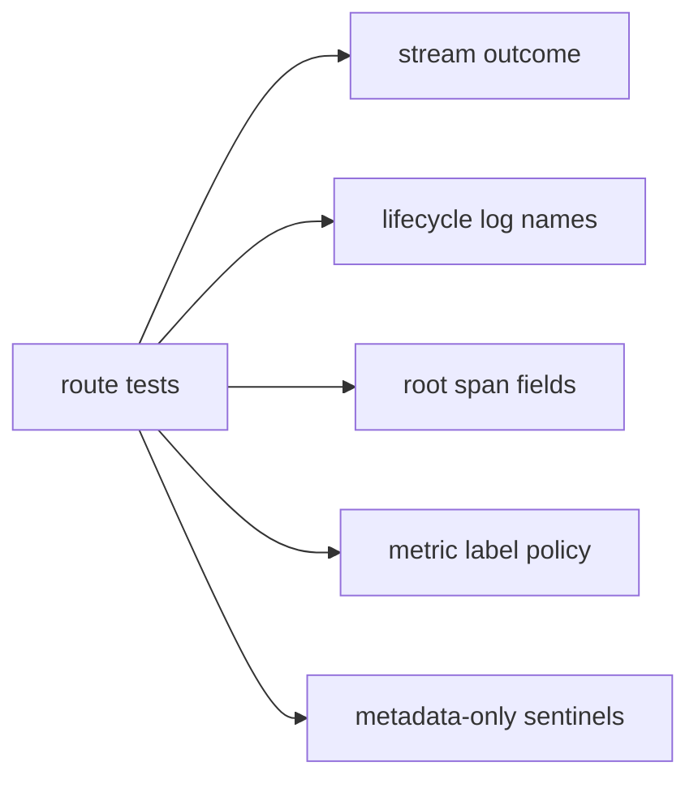
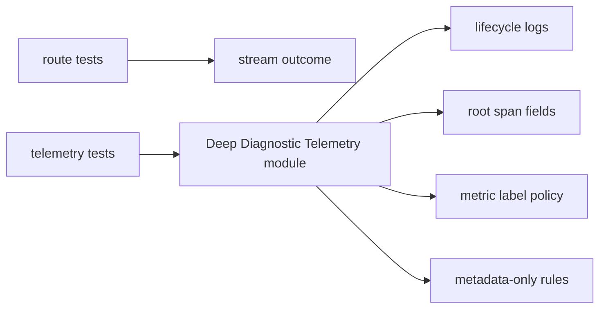
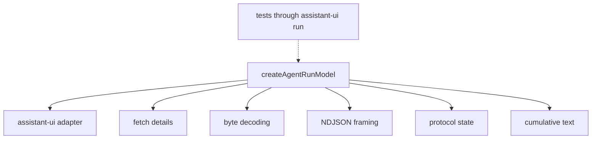
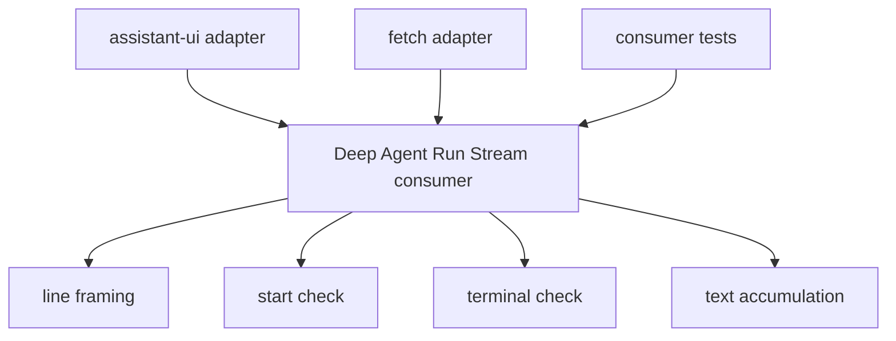
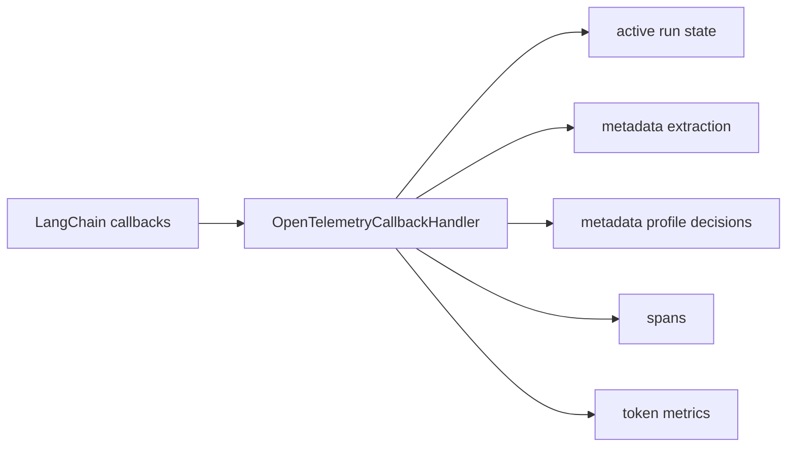
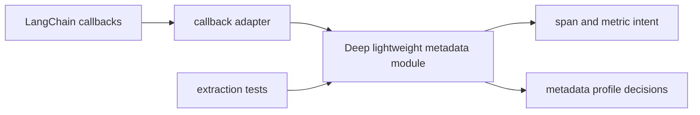
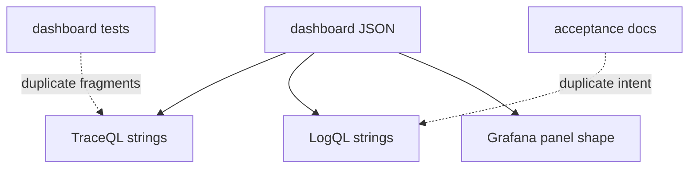
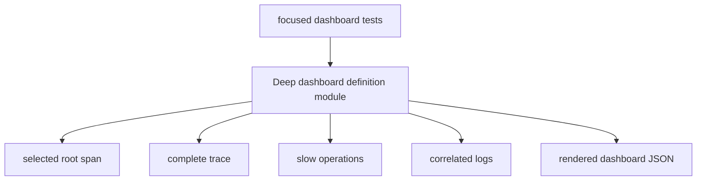

# Agent Run Diagnosis Architecture Review

Scope: after closing Agent Run Diagnosis v1. Hot paths were `apps/api/src/routes/agent-runs.ts`, `apps/web/src/lib/assistant-runtime.ts`, `packages/observability`, shared Agent Run schemas, and the Grafana dashboard files.

## Candidates

| Candidate                                                     | Strength        | Main files                                                                    |
| ------------------------------------------------------------- | --------------- | ----------------------------------------------------------------------------- |
| Deepen the Agent Run lifecycle module                         | Strong          | `apps/api/src/routes/agent-runs.ts`, `apps/api/src/routes/agent-runs.test.ts` |
| Make Diagnostic Telemetry own its contract                    | Strong          | `packages/observability/src/agent-run.ts`, route tests                        |
| Extract the web Agent Run Stream consumer                     | Strong          | `apps/web/src/lib/assistant-runtime.ts`, shared schemas                       |
| Separate LangChain adaptation from diagnostic extraction      | Worth exploring | `packages/observability/src/langchain.ts`                                     |
| Generate the Agent Run Diagnosis dashboard from query modules | Worth exploring | `ops/observability/dashboards/*`                                              |

## Deepen The Agent Run Lifecycle Module

Recommendation strength: Strong

Files:

- `apps/api/src/routes/agent-runs.ts`
- `apps/api/src/routes/agent-runs.test.ts`
- `packages/agent/src/agent-run-executor.ts`
- `packages/shared/src/schemas/agent-run.ts`

Problem:

`createAgentRunStream` mixes the Hono adapter, `ReadableStream`, executor iteration, cancellation confirmation, terminal invariants, NDJSON encoding, and telemetry finishing. The implementation has depth, but the seam is accidental file scope, so lifecycle knowledge leaks into route tests.

Solution:

Move Agent Run lifecycle behavior behind an in-process module. Keep Hono and NDJSON as adapters at the route seam.

Before:

After:

Benefits:

- locality: terminal bugs concentrate in one module
- leverage: one lifecycle test surface
- route adapter becomes shallow on purpose
- cancellation deadline becomes injectable

## Make Diagnostic Telemetry Own Its Contract

Recommendation strength: Strong

Files:

- `packages/observability/src/agent-run.ts`
- `apps/api/src/routes/agent-runs.test.ts`
- `docs/adr/0001-metadata-only-diagnostic-telemetry.md`
- `docs/adr/0002-agent-run-identifier-for-diagnosis.md`

Problem:

Metadata-only rules, lifecycle event names, root span fields, log fields, metric label policy, and fail-open behavior are repeatedly verified in route tests. That makes the telemetry module interface shallower than its responsibility.

Solution:

Let the Diagnostic Telemetry module own the Agent Run diagnostic contract. Route tests should focus on stream outcomes; telemetry tests should verify spans, logs, metrics, and metadata-only rules through the telemetry module interface.

Before:

After:

Benefits:

- locality: privacy rules concentrate
- leverage: route tests shrink
- one metadata-only test surface
- ADRs map to one module

## Extract The Web Agent Run Stream Consumer

Recommendation strength: Strong

Files:

- `apps/web/src/lib/assistant-runtime.ts`
- `apps/web/src/lib/assistant-runtime.test.ts`
- `apps/web/src/api.ts`
- `packages/shared/src/schemas/agent-run.ts`

Problem:

`createAgentRunModel` is the assistant-ui adapter, fetch caller, byte decoder, NDJSON parser, protocol state machine, and cumulative text accumulator. Tests must exercise protocol failures through fetch `Response` objects and assistant-ui run results.

Solution:

Create a deeper Agent Run Stream consumer module. Keep assistant-ui and fetch as adapters around it.

Before:

After:

Benefits:

- locality: protocol failures concentrate
- leverage: one browser parser
- tests hit one interface
- assistant adapter becomes readable

## Separate LangChain Adaptation From Diagnostic Extraction

Recommendation strength: Worth exploring

Files:

- `packages/observability/src/langchain.ts`
- `packages/observability/src/langchain.test.ts`
- `ops/observability/acceptance/agent-run-diagnosis.ts`

Problem:

`langchain.ts` mixes LangChain callback adaptation, active-run state, OpenTelemetry implementation, lightweight metadata extraction, token accounting, telemetry profile decisions, and fail-open handling.

Solution:

Split a metadata-only diagnostic extraction module from the LangChain callback adapter. The adapter translates framework events; the deeper module owns the current lightweight metadata profile: run kind/name, graph node/step, provider/model, finish reason, token counts, tool name, and metric-friendly attributes.

The metadata-only shape is a v1 product-stage choice for operational diagnosis, not a permanent privacy boundary. Future prompt-engineering or payload-aware dashboards should use a separate diagnostic profile/module with explicit storage, cardinality, and access-control decisions, rather than expanding the lightweight operational metadata path by accident.

Before:

After:

Benefits:

- locality: lightweight metadata rules central
- leverage: extraction tests stay focused
- adapter absorbs LangChain drift
- fail-open paths get smaller

## Generate The Agent Run Diagnosis Dashboard From Query Modules

Recommendation strength: Worth exploring

Files:

- `ops/observability/dashboards/agent-run-diagnosis.dashboard.json`
- `ops/observability/dashboards/agent-run-diagnosis.dashboard.test.ts`
- `ops/observability/agent-run-diagnosis.acceptance.md`

Problem:

TraceQL and LogQL semantics leak into dashboard tests and acceptance docs as repeated fragments. The JSON artifact is the implementation, but tests also know query internals.

Solution:

Build the dashboard JSON from named query modules that own Agent Run Diagnosis query syntax.

Before:

After:

Benefits:

- locality: query syntax central
- leverage: generated panels repeat safely
- datasource seam stays explicit
- tests assert domain intent

## Top Recommendation

Start with **Deepen the Agent Run lifecycle module**.

It has the highest leverage because the current route owns the riskiest Agent Run Outcome rules: cancellation confirmation, malformed executor output, exactly-one terminal event, and telemetry finishing. Deepening that module would create better locality for future Agent Run work and make later refactors smaller.
