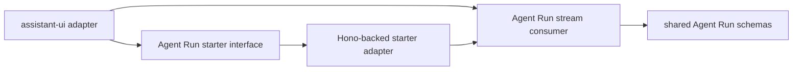

# Agent Run Stream Consumer Deepening Handoff

Status: codebase design complete; ready for implementation.

Source review: `docs/architecture/agent-run-diagnosis-review.md`

## Shared decisions

- The selected candidate is **Extract The Web Agent Run Stream Consumer**.
- The stream consumer module lives in `apps/web/src/lib/agent-run-stream-consumer.ts`.
- The Hono-backed Agent Run starter lives in `apps/web/src/lib/agent-run-client.ts`.
- `apps/web/src/lib/assistant-runtime.ts` remains the assistant-ui adapter.
- The web Agent Run request should use the typed Hono client:

```ts
api.api["agent-runs"].$post(...)
```

- The Hono-backed starter is not a wrapper for type safety. It owns Agent Run request behavior:
  - choose the Agent Run route
  - send `{ message }` with the caller's abort signal
  - reject non-OK responses
  - read `X-Agent-Run-Id`
  - ensure a response body exists
  - return the stream input expected by the consumer
- `createAgentRunModel` accepts an injectable Agent Run starter and defaults to the Hono-backed implementation.
- The stream consumer is below HTTP. It does not know about Hono, URLs, headers, status codes, or assistant-ui.
- The stream consumer input is an expected Agent Run ID plus a `ReadableStream<Uint8Array>`.
- The stream consumer output is a pull-based `AsyncIterable<AgentRunStreamUpdate>`.
- Consumer updates are Agent Run domain-shaped, not `ChatModelRunResult`.
- `run.started` is validated internally and not yielded.
- `message.delta` updates yield cumulative text, not deltas.
- Valid `run.failed` and `run.cancelled` terminal events are yielded as domain terminal updates, not protocol errors.
- Malformed streams and protocol violations throw an exported `AgentRunStreamProtocolError` with the existing public message: `Agent Run stream violates protocol`.

## Codebase design decisions

The extraction should create one deep in-process module and two adapter modules:



The deep module is `agent-run-stream-consumer.ts`. Its interface should be small: expected Agent Run ID plus stream body in, domain-shaped updates out. Everything else inside that module is implementation detail: byte decoding, line framing, schema parsing, first-event validation, terminal state, and cumulative text.

The real seam for assistant runtime tests is the Agent Run starter function. Do not add a public Hono-client injection option to the starter only for tests. `agent-run-client.test.ts` can mock the shared `api` export because `agent-run-client.ts` is intentionally the adapter that binds this feature to the repo's typed Hono client.

Resolve the open naming and shape questions as follows:

- Name the consumer function `consumeAgentRunStream`. It does more than read records: it validates and interprets the stream protocol into domain updates.
- Name the Hono-backed starter `startAgentRunStream`. It starts the web Agent Run and returns the stream input for the consumer without exposing HTTP in the assistant adapter.
- Keep the injectable assistant-runtime dependency at the business-shaped starter function, not at the Hono client.
- Include the final cumulative text on `failed` and `cancelled` terminal updates. Terminal updates should describe the whole visible state at termination, not require callers to remember prior updates.

## Final interfaces

The Hono-backed starter should expose a business-shaped interface:

```ts
export type StartAgentRunOptions = {
  message: string;
  signal: AbortSignal;
};

export type StartedAgentRunStream = {
  agentRunId: string;
  body: ReadableStream<Uint8Array>;
};

export type StartAgentRunStream = (options: StartAgentRunOptions) => Promise<StartedAgentRunStream>;

export const startAgentRunStream: StartAgentRunStream;
```

The stream consumer should expose one pull-based interface:

```ts
export type ConsumeAgentRunStreamOptions = {
  agentRunId: string;
  body: ReadableStream<Uint8Array>;
};
```

The yielded updates should stay domain-shaped:

```ts
export type AgentRunStreamUpdate =
  | { agentRunId: string; text: string; type: "message" }
  | { agentRunId: string; text: string; type: "completed" }
  | {
      agentRunId: string;
      errorClassification: AgentRunErrorClassification;
      text: string;
      type: "failed";
    }
  | { agentRunId: string; text: string; type: "cancelled" };

export class AgentRunStreamProtocolError extends Error {
  constructor();
}

export const consumeAgentRunStream: (
  options: ConsumeAgentRunStreamOptions,
) => AsyncIterable<AgentRunStreamUpdate>;
```

`AgentRunStreamProtocolError` should keep the public message `Agent Run stream violates protocol` and set a stable class name. Tests should assert `instanceof AgentRunStreamProtocolError` where practical and still preserve the public message behavior.

## Consumer responsibilities

The stream consumer owns:

- byte decoding
- NDJSON line framing
- Agent Run event validation through shared schemas
- first-event `run.started` validation against the expected Agent Run ID
- Agent Run protocol state
- exactly one terminal event
- event-after-terminal rejection
- cumulative text accumulation
- classification of malformed streams as `AgentRunStreamProtocolError`

It does not own:

- assistant-ui `ChatModelRunResult` mapping
- latest-user-message extraction
- Hono client usage
- HTTP request construction
- response status handling
- response header extraction
- content-type validation
- future non-web Agent Run runtimes

## Adapter responsibilities

The Hono-backed Agent Run starter owns:

- using `api.api["agent-runs"].$post(...)`
- passing `{ json: { message }, signal }`
- rejecting failed HTTP responses with the existing request failure behavior
- extracting the `X-Agent-Run-Id` response header
- requiring a response body
- returning `{ agentRunId, body }`

The assistant-ui adapter owns:

- extracting the latest user text from assistant-ui messages
- trimming the message before starting the Agent Run
- passing the assistant-ui abort signal to the Agent Run starter
- mapping consumer message and completed updates to `ChatModelRunResult`
- preserving current failed/cancelled behavior by throwing `Agent Run did not complete successfully`

## Test split

`apps/web/src/lib/agent-run-stream-consumer.test.ts` should own:

- split UTF-8 and NDJSON framing
- first event must be matching `run.started`
- malformed records throw `AgentRunStreamProtocolError`
- unknown protocol versions or event types throw `AgentRunStreamProtocolError`
- premature EOF throws `AgentRunStreamProtocolError`
- duplicate terminal events throw `AgentRunStreamProtocolError`
- events after termination throw `AgentRunStreamProtocolError`
- cumulative text updates
- valid failed and cancelled terminal updates

`apps/web/src/lib/agent-run-client.test.ts` should own:

- sending `{ message }` through `api.api["agent-runs"].$post(...)`
- passing the caller's abort signal
- rejecting non-OK responses
- rejecting missing `X-Agent-Run-Id`
- rejecting missing response body
- returning the Agent Run ID and stream body

`apps/web/src/lib/assistant-runtime.test.ts` should shrink to assistant-ui adapter behavior:

- latest user text is sent to the Agent Run starter
- abort signal is passed through
- consumer message updates map to cumulative assistant text
- completed updates map to assistant-ui completion status
- failed and cancelled terminal updates throw the existing unsuccessful-run error

## Open design questions for codebase-design

- Resolved: use `consumeAgentRunStream`.
- Resolved: use `startAgentRunStream`.
- Resolved: do not expose Hono-client injection; mock `apps/web/src/api.ts` in `agent-run-client.test.ts`.
- Resolved: failed and cancelled terminal updates include final cumulative text.
